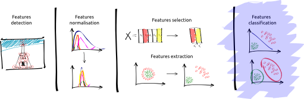

# SI - Pattern Recognition

**Table-of-contents**

* [Dependencies](#dependencies)
* [Probabilistic classifiers](#probabilistic-classifiers)
* [To perform the practise](#to-perform-the-practise)

More description is given in the subsections.

## Dependencies

The following practise has been tested with **Ubuntu 14.04**.

In order to carry out the practise, the following dependencies are needed:

* ipython notebook - `conda install ipython-notebook`
* scikit-learn - `conda install scikit-learn`
* scikit-image - `conda install scikit-image`
* scikit-fuzzy - `pip install -U scikit-fuzzy`
* mpld3 - `pip install mpld3`

We strongly recommend to use a Linux environment to perform this practise.

## Probabilistic classifiers

The following module of the framework will be studied:

### Euclidean and Mahalanobis distances

Comparison of [Euclidean distance](http://en.wikipedia.org/wiki/Euclidean_distance) and [Mahalanobis distance](http://en.wikipedia.org/wiki/Mahalanobis_distance).

### Logistic regression for classification

Implementation of a [logistic regression classifier](http://en.wikipedia.org/wiki/Logistic_regression) through gradient descent.

### Naive Bayes' classifier

Naive Bayes' classifier with understanding of Maximum Likelihood (ML) and Maximum *a-posteriori* (MAP). This classifier to segment vessels in retina images.

## To perform the practise

### Assignment procedure

In order to perform the practise, you will have to fork the current project. To do so,

- [Fork](https://help.github.com/articles/fork-a-repo/) the current project by click on the Fork icon ,
- Select your GitHub profile if necessary,
- Clone the repository ,
- Solve the practise by executing the Ipython notebook,
- Commit & push your changes in your own repository,
- Make a [pull request](https://help.github.com/articles/using-pull-requests/).

### Execute the Ipython notebook

Enter the following command in a terminal `ipython notebook`.

This command should run the server locally via your default web browser and you will be able to play with the notebook.

If you are just curious to see what the ipython notebook look like, you can view it [there](http://nbviewer.ipython.org/github/ViBOT-Erasmus/B31XI-SI-Probabilistic-Classifiers/blob/master/04-probabilistic-classifiers.ipynb).

Enjoy!!!

